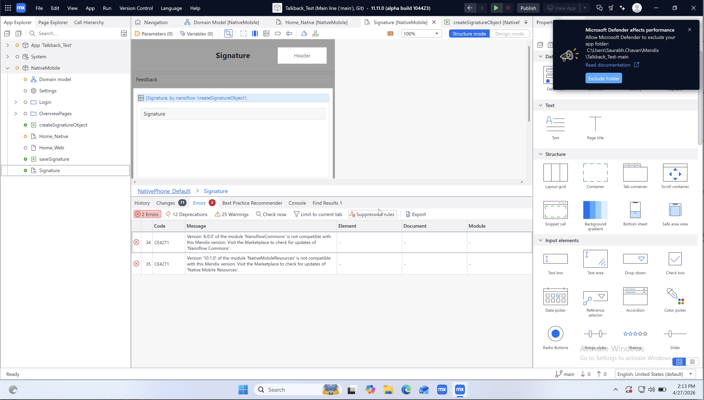
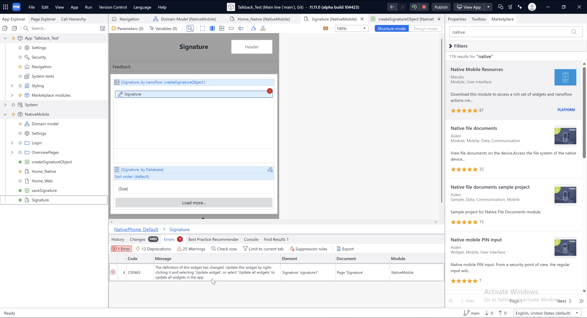
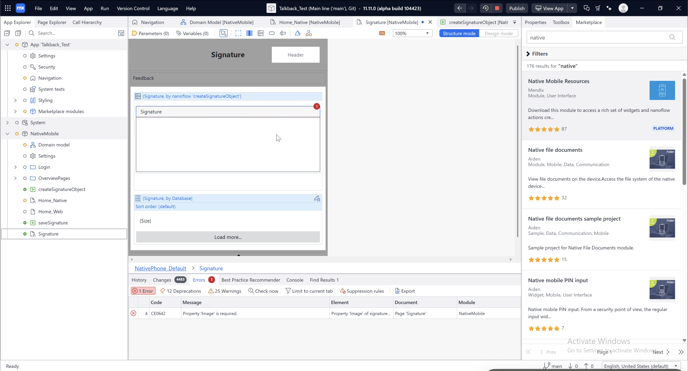
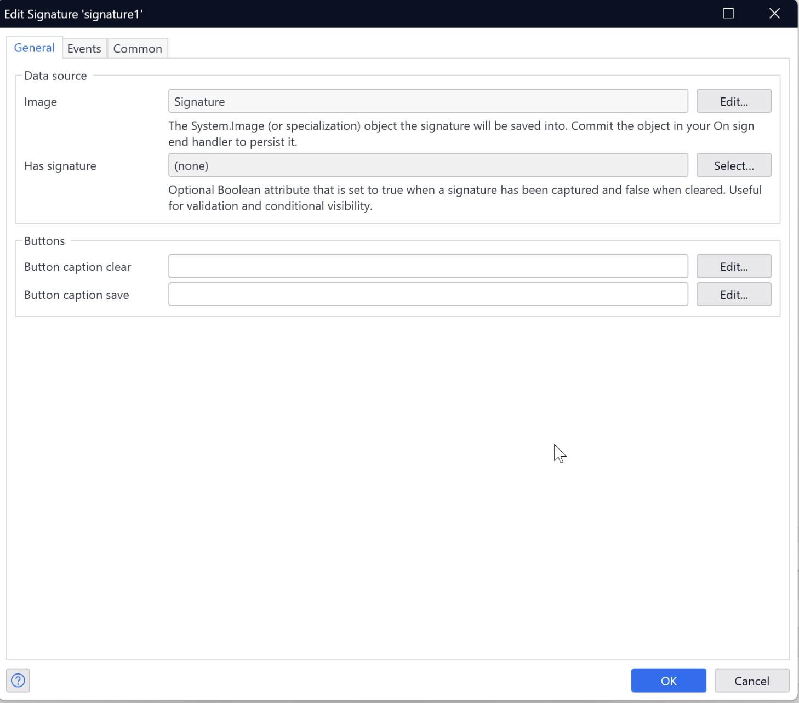
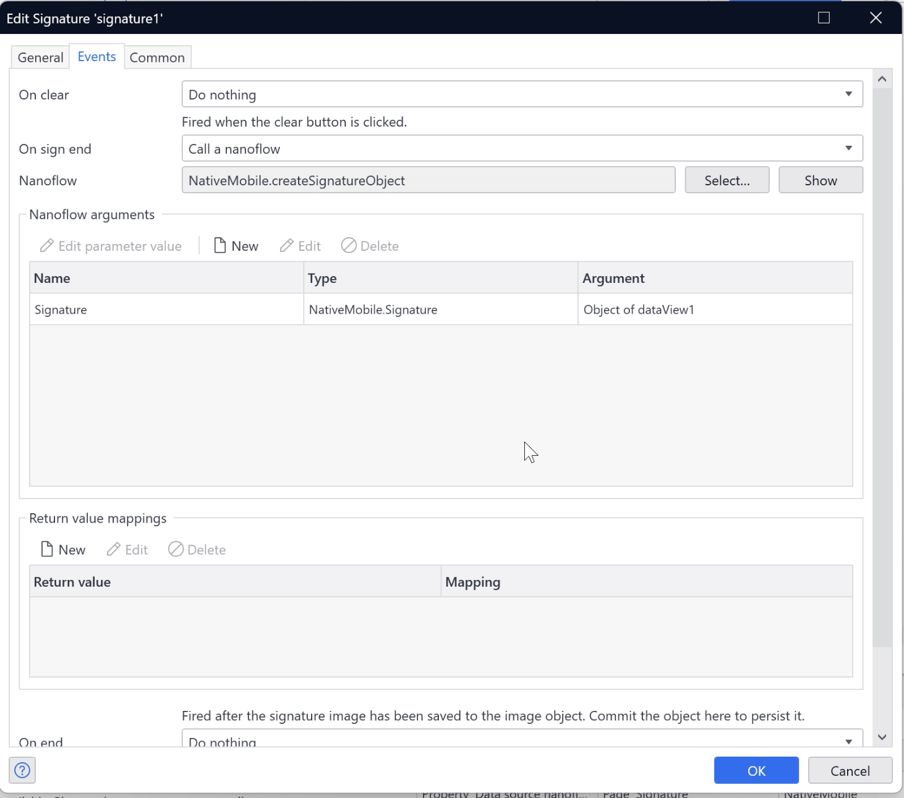
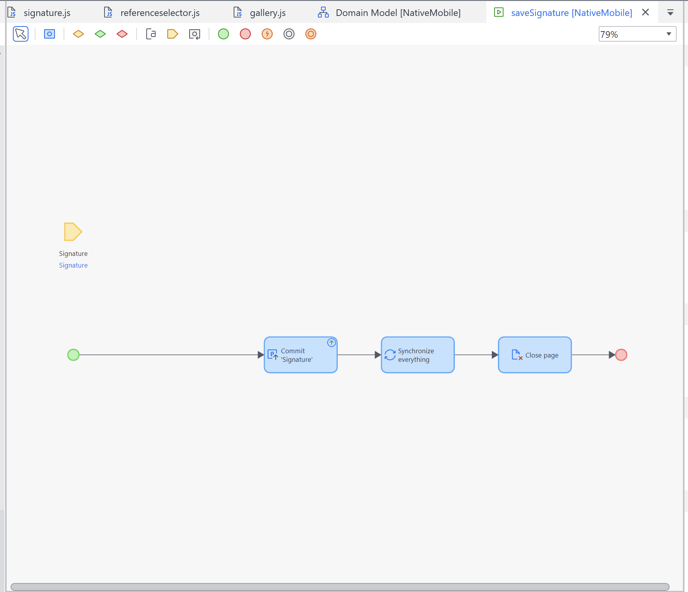

# Signature (Native) — Migration Guide

This document covers breaking changes and migration steps when upgrading the Signature native widget.

---

## Migrating to v2.4.0 — Direct Image Save Mode

### What Changed

Previously, you needed to store the base64-encoded signature string in a String attribute, then call a nanoflow that used the **base64DecodeToImage** action to convert that string into an image, and then commit the object before continuing with the rest of your flow. With this update, that overhead is removed — the widget now handles the base64-to-image conversion internally.

1. The widget now saves the signature directly into an entity object of generalization `System.Image`, instead of storing a base64-encoded string in a String attribute.
2. The **On save** event has been renamed to **On sign end** under the **Events** tab.
3. A new optional property, **Has signature**, has been added.

---

### New Required Property: Image

You must assign an object of an entity with generalization `System.Image` to the **Image** property. The widget populates this object after the user taps **Save**. You are responsible for committing it inside the **On sign end** action.

**Before (pre-v2.4.0):** A String attribute holding a base64-encoded PNG was assigned to the widget.

**After (v2.4.0):** A `System.Image` object reference is assigned to the **Image** property.

**Steps:**

1. In your domain model, ensure you have an entity with generalization `System.Image`.
2. In your page, create or retrieve an instance of that entity and pass it as the data source of the widget.
3. In the widget's **Image** property, select that object.

---

### New Optional Property: Has Signature

A Boolean attribute can be linked via the **Has signature** property. The widget automatically sets this attribute to `true` when a signature is captured and to `false` when the canvas is cleared. You can use it for:

-   Conditional visibility (for example, showing a "Signed" indicator)
-   Validation in nanoflows before form submission

This property is optional — existing configurations work without it.

---

### Event Handler Changes: on sign end

The **On save** event handler has been renamed to **On sign end**. You can assign the nanoflow that was previously used for **On save** to this action. Make sure to:

1. Remove the **base64DecodeToImage** action from the nanoflow, as it is no longer needed and not removing it may produce some errors.
2. Keep the **Commit object** activity in the nanoflow.
3. Keep any subsequent actions in the nanoflow, such as **Synchronize** or **Close page**.

> **Important:** If you do not commit the object in **On sign end**, the signature will not be persisted. The widget populates the in-memory object, but you are responsible for committing it.

---

## Quick Checklist

-   [ ] An entity with generalization `System.Image` exists in the domain model
-   [ ] The widget's **Image** property is set to an instance of that entity
-   [ ] The **On sign end** action commits the image object; assign the nanoflow that was previously used for **On save**
-   [ ] The **base64DecodeToImage** action has been removed from the nanoflow
-   [ ] Optional: A Boolean attribute is wired to **Has signature** for validation

---

## Example: Migrating from Studio Pro 10.24

The following is a real-world walkthrough of migrating a Mendix app from Studio Pro 10.24 to the version that includes this signature widget update.

1. **Resolve migration errors** — Opening the app in the new Studio Pro version showed two errors about outdated modules: **NanoflowCommons** and **Native Mobile Resources**. These are unrelated to the signature widget. Updating both modules resolved the errors.

    

2. **Update the widget** — An **Update widget** error appeared. Click **Update** (or **Update all widgets**) to apply the new version.

    

3. **Fix the required Image property** — After updating, a new validation error appeared: _Property Image is required_.

    

    To fix this, open the signature widget configuration and select the appropriate `System.Image` object reference in the **Image** property:

    

4. **Update the On sign end action** — In the **Events** tab, assign the nanoflow that was previously used for **On save** to the **On sign end** action.

    

    Next, open that nanoflow and remove the **base64DecodeToImage** action. Ensure the nanoflow still has a **Commit object** activity, followed by any other required actions such as **Synchronize** or **Close page** etc.

    

---

## Known Limitations

-   The signature widget currently does not work on Android due to a known issue in React Native.
-   With this update, the previous String attribute property has been removed. The widget no longer stores a base64-encoded string. If you were using that base64 value as input to any API, integration, or export, those values will be empty going forward, as nothing is written to that attribute anymore.
