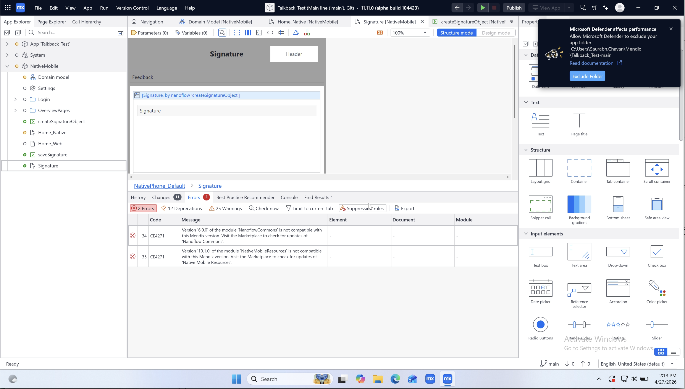
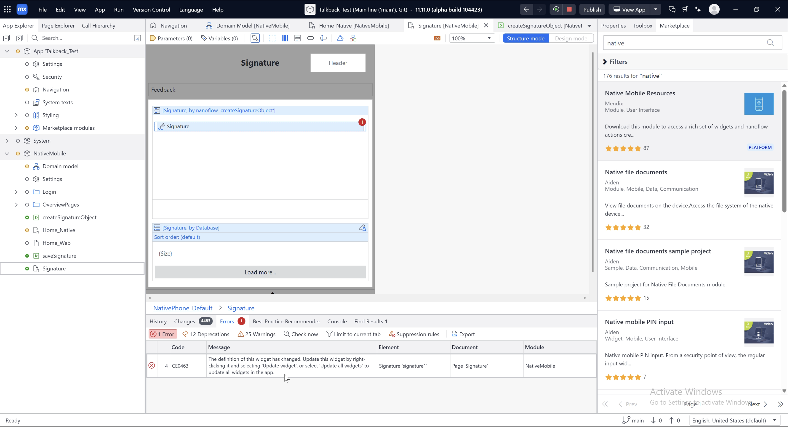
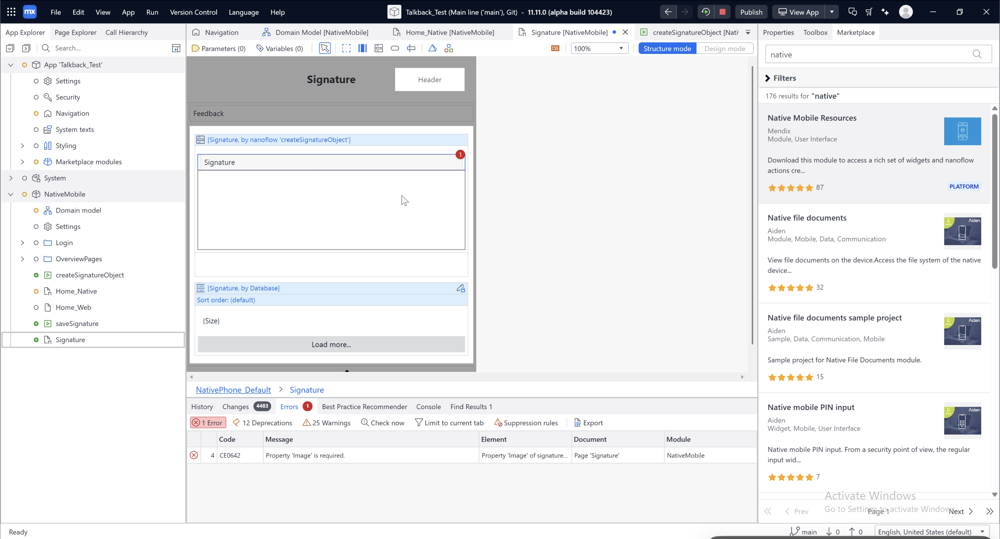
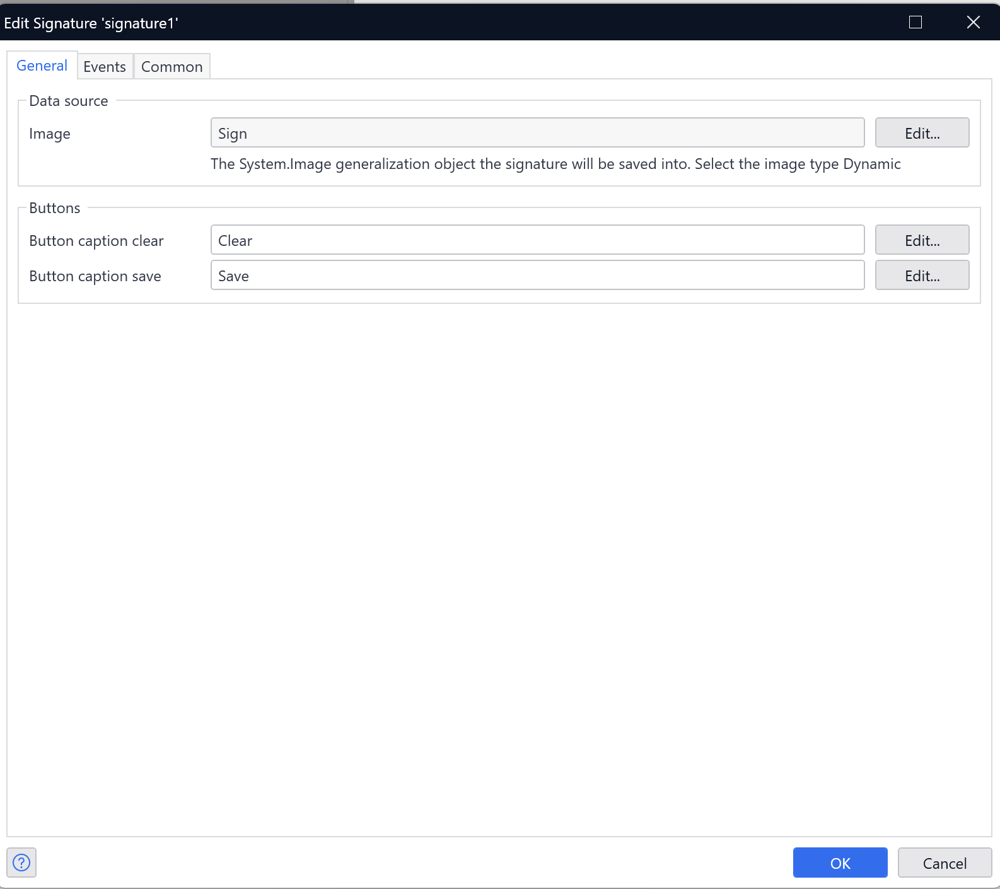
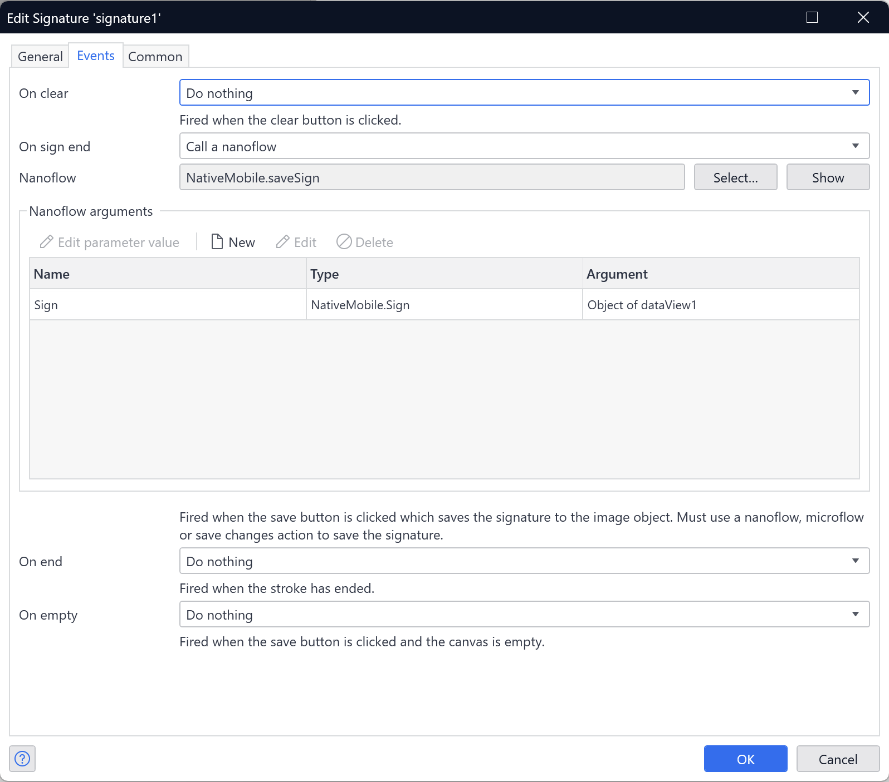
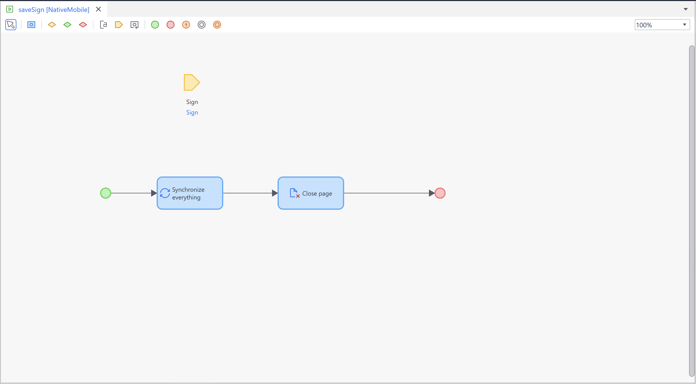

# Signature widget

Creates a canvas on which a user can draw.

## Configuration Guide

### Overview

This guide covers the required configuration and best practices for implementing the Signature widget in your Mendix Native Mobile application. It includes instructions for new implementations as well as migration steps for existing projects using the Signature widget.

**Version Information:** The changes described in this guide apply to **Native Mobile Resources version 12.5.0 and later**. If you are using an earlier version, please refer to the legacy documentation below.

---

### Advantages of the New Signature Widget (Native Mobile Resources 12.5.0+)

The updated Signature widget simplifies configuration and reduces manual setup:

-   No need to manually assign a base64 string to an entity attribute.
-   The base64DecodeToImage action and commit object activity are no longer required in your nanoflow.
-   For entities with synchronization mode set to **All Objects**, you only need to add a synchronize action if required by your implementation. For entities with synchronization mode set to **Online**, synchronization is not required.

---

### Required Configuration for New Implementations

#### 1. Image Property (Required)

The `Image` property must be configured with an entity that **generalizes System.Image**.

**Configuration Steps:**

1. **Create an entity that generalizes System.Image:**

    ```
    Example:
       Entity: CustomerSignature
       Generalization: System.Image
    ```

2. **Configure the widget:**
    - In the **Data source** section, for `Image` property select Image type as **Dynamic**.
    - Set the `System.Image` entity object to it.

**Studio Pro Validation:**

-   Selecting Static images will display the error: _"Image must be a dynamic image type. Static images cannot be uploaded to."_

---

#### 2. On Sign End Action (Required)

The `On sign end` action is **required** and triggers when the user clicks the Save button to save the signature to the image object.

**Supported Action Types:**

-   **Call a nanoflow**
-   **Call a microflow**
-   **Save changes**

**Important:**

-   If the `On sign end` action is not configured with one of the supported action types, the signature will not be saved. The operation will fail silently without displaying a Studio Pro error. You can set any required actions (for ex.- show pages, close pages) inside that nanoflow/microflow.

---

### Migration Steps for Existing Projects

If you are upgrading from a version prior to Native Mobile Resources 12.5.0, follow these migration steps to adopt the new implementation.

#### What Changed

Previously, you needed to store the base64-encoded signature string in a String attribute, then call a nanoflow that used the **base64DecodeToImage** action to convert the string into an image, and finally commit the object before continuing with your flow. Starting from Native Mobile Resources 12.5.0, the widget now handles the base64-to-image conversion internally, eliminating this overhead.

**Key Changes:**

1. The widget now saves the signature directly to an entity that generalizes `System.Image`, instead of storing a base64-encoded string in a String attribute and then converting it to Image.
2. The **On save** event has been renamed to **On sign end** under the **Events** tab.

#### Example: Migrating from Studio Pro 10.24 or Earlier 11.x.x

The following is a step-by-step walkthrough of migrating a Mendix app from Studio Pro 10.24 or an earlier 11.x.x version to a version that includes the updated Signature widget.

1. **Resolve migration errors** — After converting the app to the new Studio Pro version, you may see errors about outdated modules: **NanoflowCommons** and **Native Mobile Resources**. These errors are unrelated to the Signature widget. Update both modules from the Marketplace to resolve these errors.

    

2. **Update the widget** — If an **Update widget** error appears, click **Update** (or **Update all widgets**) to apply the new version.

    

3. **Configure the Image property** — After updating, a new validation error will appear: _Property Image is required_.

    

    To resolve this, open the Signature widget configuration and select the appropriate `System.Image` object reference in the **Image** property with image type set to **Dynamic**:

    

4. **Update the On sign end action** — In the **Events** tab, assign the nanoflow or other supported action that was previously used for **On save** to the **On sign end** action. You must assign either a nanoflow, microflow, or save changes action.

    

    Next, open the nanoflow and remove the **base64DecodeToImage** action and **Commit object** activity, as they are no longer required. Keeping the **base64DecodeToImage** action will fail the signature from being stored. Keep your existing actions for ex.- **Synchronize** or **Close page**.

    

---

### Troubleshooting

#### Error: "Property Image is required"

**Cause:** The Image property is not configured.

**Solution:**

1. Select the Signature widget.
2. In the **Data source** section, configure the Image property.
3. Select a System.Image entity object.

#### Error: "Image must be a dynamic image type. Static images cannot be upload to"

**Cause:** You selected a static image type.

**Solution:**

1. Create an entity that generalizes System.Image.
2. In the Signature widget, set the Image property to use a dynamic image type.
3. Select the System.Image entity object.

#### Signature is not being stored in the object

**Cause:** The `On sign end` action is not configured with a supported action type.

**Solution:**

1. Configure the `On sign end` action with a supported action type: call a nanoflow, call a microflow, or save changes.
2. Implement your project-specific logic inside the nanoflow or microflow. You can use other actions (for ex.- show page or close page) within the nanoflow or microflow as needed.

---

### Breaking Changes (Native Mobile Resources 12.5.0+)

-   With this update, the previous **Attribute** property has been removed. The widget no longer stores a base64-encoded string into it. If you were using that base64 value as input to any API, integration, or export, those values will be empty going forward, as nothing is written to that attribute anymore.

---

## Legacy Documentation (Native Mobile Resources < 12.5.0)

If you are using a version prior to Native Mobile Resources 12.5.0, the Signature widget uses a different implementation:

### Configuration for Legacy Versions

1. **Attribute Property (String):** Configure a String attribute to store the base64-encoded signature.
2. **On Save Event:** Create a nanoflow that:
    - Uses the **base64DecodeToImage** action from NanoflowCommons to convert the base64 string to an image
    - Performs any additional actions as you require(commit object,synchronization, navigation, etc.)
